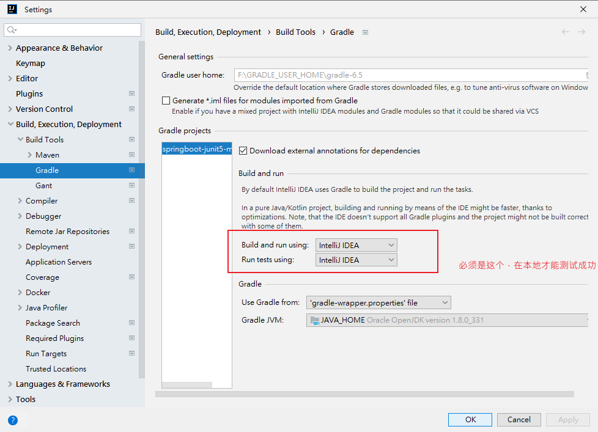

# springboot-junit5-mockito2
Show case for how to use junit 5 and mockito 2 for unit testing and integration test with Spring boot 2

-------------------
### Tech stack:
- Spring boot 2
- Junit 5
- Mockito 2
-------------------
### 本地测试注意
### 配置测试运行器
- 在Gradle工具窗口中，打开 Gradle设置页面。

- 在“ 运行测试使用”列表中，为选定的Gradle项目选择以下测试运行器选项之一：

- Gradle：IntelliJ IDEA使用Gradle作为默认测试运行器。结果，在持续集成（CI）服务器上获得相同的测试结果。此外，在命令行中运行的测试将始终在IDE中运行。
- IntelliJ IDEA：选择此选项可将测试过程委派给IntelliJ IDEA。在这种情况下，IntelliJ IDEA使用 JUnit 测试运行器，并且由于增量编译，测试运行得更快。

-------------------

